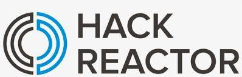

<h1 align="center"></h1>

# Project Catwalk

This is a front end capstone project for Hackreactor. The aim of this project is outlined in the following overview:

> "Our outdated client-facing retail web-portal has become significantly outdated and has been proven to be hurting sales numbers.   Project Catwalk comprises a complete redesign of the retail portal designed to address this concern and modernize the site.  This document outlines the features to be implemented as part of Project Catwalk in its initial release.  The following requirements define the new user interface required for customers to browse items in our retail catalog."

## Getting Started

- Fork or directly clone this repository to your local machine
- Use the `npm i` command to install dependencies including:
  - `React`
  - `Webpack`
  - `Node`
  - `Babel-loader`
- Once the dependencies are finished installing, use the `npm start` command inside the root directory to open the app in your local browser of choice

## Built With

- [React](https://reactjs.org/)

## Project Management

- Check out the [Trello Board](https://trello.com/b/fKvvR8aT/agile-sprint-board) for this project to see what was completed along the way

## Authors

- [Andrew Lee](https://github.com/turkeyfats)
- [Leslie Rodriguez](https://github.com/thereactgirl)
- [Zad Castaneda](https://github.com/castzad)